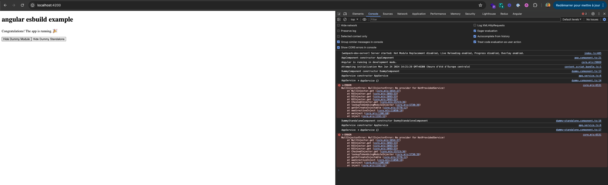
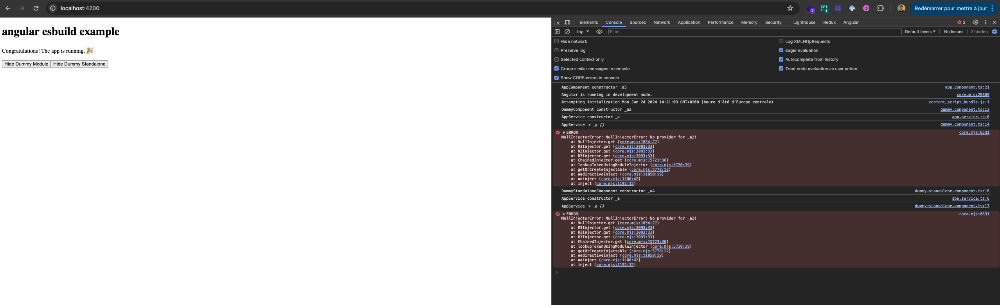

# AngularEsbuildExample

This project was generated with [Angular CLI](https://github.com/angular/angular-cli) version 17.3.3.
It is a reproduction project for an issue occurring since the default angular builder is esbuild. The provider name is obfuscated in the stacktrace when a provider is injected by a component but not provided.

## Development server

Run `npm run start` for a dev server using esbuild. Navigate to `http://localhost:4200/`. The application will automatically reload if you change any of the source files.

Run `npm run start:webpack` for a dev server using webpack. Navigate to `http://localhost:4200/`. The application will automatically reload if you change any of the source files.

## Build

Run `npm run build` to build the project with esbuild. The build artifacts will be stored in the `dist/` directory.

Run `npm run build:wepback` to build the project with webpack. The build artifacts will be stored in the `dist_webpack/` directory.

## Example
Using webpack the stacktrace is clear and shows the provider name that is missing. Using esbuild the provider name is obfuscated.

